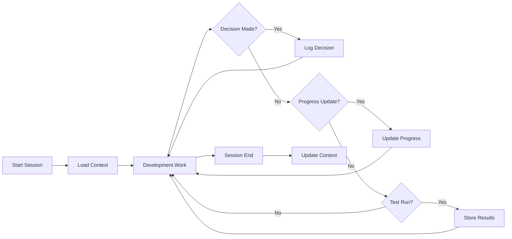
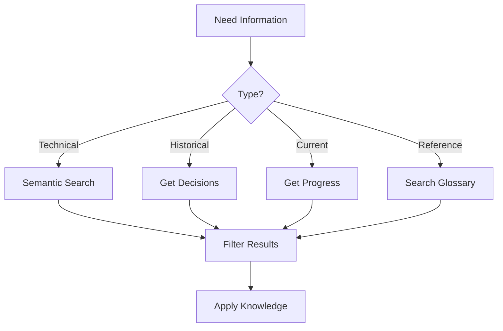

# ConPort Strategy for MythalTerminal
**Version 1.0 - 2025-08-10**

## Overview
This document defines the comprehensive Context Portal (ConPort) strategy for MythalTerminal, establishing how we leverage ConPort as the project's persistent memory system and knowledge graph.

## Core Philosophy
ConPort serves as MythalTerminal's "memory bank" - a structured, queryable knowledge base that enables intelligent context-aware development and maintenance. It replaces scattered documentation with a unified, semantic-search-enabled knowledge system.

## 1. Knowledge Architecture

### 1.1 Product Context Structure
```yaml
product_context:
  project_overview:
    name: "MythalTerminal"
    purpose: "AI-centric terminal with intelligent context management"
    vision: "Seamless AI-assisted terminal experience with multi-Claude instances"
  
  architecture:
    frontend: "React 18 + TypeScript + Tailwind"
    backend: "Electron 33 + SQLite + node-pty"
    ai_integration: "Anthropic SDK (planned)"
    mcp_servers: ["puppeteer", "filesystem", "context7", "playwright", "conport"]
  
  key_features:
    - "Multi-Claude instance management"
    - "Intelligent context switching"
    - "Auto-archiving conversations"
    - "Terminal multiplexing"
    - "Semantic project memory"
```

### 1.2 Active Context Structure
```yaml
active_context:
  current_focus: "Architecture redesign for Claude SDK integration"
  recent_changes:
    - "Fixed process.cwd() renderer issue"
    - "Enabled headless E2E testing"
    - "Generated visual regression baselines"
  
  open_issues:
    - "Claude integration non-functional"
    - "API key management needed"
    - "Context management implementation pending"
  
  next_milestones:
    - "Implement Anthropic SDK integration"
    - "Add API key configuration UI"
    - "Connect terminal to Claude API"
```

## 2. Decision Logging Pattern

### 2.1 Decision Categories
- **architecture**: System design choices
- **implementation**: Code-level decisions
- **testing**: Test strategy decisions
- **integration**: Third-party integration choices
- **ui/ux**: User interface decisions
- **performance**: Optimization decisions

### 2.2 Decision Template
```python
log_decision(
    summary="Short decision title",
    rationale="Why this decision was made",
    implementation_details="How it will be/was implemented",
    tags=["category", "priority", "component"]
)
```

### 2.3 Example Decisions
```python
# Architecture Decision
log_decision(
    summary="Use Anthropic SDK instead of CLI spawning",
    rationale="Claude CLI doesn't exist; SDK provides proper API integration",
    implementation_details="Replace spawn() with SDK client, add API key management",
    tags=["architecture", "critical", "claude-integration"]
)

# Implementation Decision
log_decision(
    summary="Replace process.cwd() with hardcoded path in renderer",
    rationale="process.cwd() not available in Electron renderer process",
    implementation_details="Use '/home/user/project' as default in App.tsx",
    tags=["implementation", "electron", "bug-fix"]
)
```

## 3. Progress Tracking Methodology

### 3.1 Progress States
- **TODO**: Not started
- **IN_PROGRESS**: Currently working
- **BLOCKED**: Waiting on dependency
- **DONE**: Completed
- **CANCELLED**: No longer needed

### 3.2 Progress Hierarchy
```
Main Task (parent_id: null)
├── Subtask 1 (parent_id: main_task_id)
│   ├── Sub-subtask 1.1
│   └── Sub-subtask 1.2
└── Subtask 2 (parent_id: main_task_id)
```

### 3.3 Progress Linking
Link progress to related items:
```python
log_progress(
    status="IN_PROGRESS",
    description="Implementing Claude SDK integration",
    linked_item_type="decision",
    linked_item_id="13",  # Decision about SDK integration
    link_relationship_type="implements_decision"
)
```

## 4. Custom Data Organization

### 4.1 Data Categories
```yaml
Categories:
  ProjectGlossary:
    - Technical terms and definitions
    - Component names and purposes
    - API endpoint documentation
  
  TestResults:
    - Test execution metrics
    - Coverage reports
    - Performance benchmarks
  
  CodePatterns:
    - Reusable code snippets
    - Common implementations
    - Best practices
  
  Dependencies:
    - Package versions
    - Compatibility notes
    - Update history
  
  DebugSolutions:
    - Error messages and fixes
    - Troubleshooting guides
    - Known workarounds
```

### 4.2 Custom Data Storage Pattern
```python
# Store structured data
log_custom_data(
    category="TestResults",
    key="2025-08-10-e2e",
    value={
        "total": 25,
        "passed": 25,
        "failed": 0,
        "duration": "45s",
        "coverage": "86.86%"
    }
)

# Store glossary entries
log_custom_data(
    category="ProjectGlossary",
    key="ClaudeInstanceManager",
    value="Core class managing multiple Claude AI instances for different purposes"
)
```

## 5. System Patterns

### 5.1 Pattern Categories
- **architectural_patterns**: High-level design patterns
- **code_patterns**: Reusable code structures
- **testing_patterns**: Test methodologies
- **workflow_patterns**: Development workflows
- **debugging_patterns**: Problem-solving approaches

### 5.2 Pattern Documentation
```python
log_system_pattern(
    name="electron_ipc_pattern",
    description="Standard IPC communication between main and renderer processes",
    tags=["electron", "ipc", "architecture"]
)

log_system_pattern(
    name="headless_testing_pattern",
    description="Use xvfb-run for headless E2E testing in CI/CD",
    tags=["testing", "playwright", "ci-cd"]
)
```

## 6. Semantic Search Strategy

### 6.1 Search Patterns
```python
# Find related decisions
semantic_search_conport(
    query_text="Claude integration architecture",
    filter_item_types=["decision"],
    top_k=5
)

# Find solutions to problems
semantic_search_conport(
    query_text="electron renderer process error",
    filter_item_types=["custom_data"],
    filter_custom_data_categories=["DebugSolutions"]
)

# Find test results
search_custom_data_value_fts(
    query_term="e2e test",
    category_filter="TestResults"
)
```

### 6.2 Query Optimization
- Use specific technical terms
- Include component names
- Reference error messages exactly
- Combine filters for precision

## 7. Knowledge Graph Building

### 7.1 Relationship Types
```yaml
Relationships:
  implements: "Progress implements Decision"
  fixes: "Decision fixes Issue"
  depends_on: "Component depends on Component"
  related_to: "Pattern related to Pattern"
  references: "Documentation references Code"
  uses: "Component uses Pattern"
```

### 7.2 Linking Strategy
```python
# Link decision to implementation
link_conport_items(
    source_item_type="decision",
    source_item_id="13",
    target_item_type="progress_entry",
    target_item_id="20",
    relationship_type="implemented_by",
    description="SDK integration decision implemented"
)

# Link pattern to component
link_conport_items(
    source_item_type="system_pattern",
    source_item_id="electron_ipc_pattern",
    target_item_type="custom_data",
    target_item_id="ClaudeManager",
    relationship_type="used_by",
    description="IPC pattern used in Claude management"
)
```

## 8. Session Management

### 8.1 Session Initialization
```python
# At session start
1. Get product context
2. Get active context
3. Get recent activity (last 24 hours)
4. Retrieve open progress items
5. Load relevant system patterns
```

### 8.2 Session Updates
```python
# During session
- Log decisions as they're made
- Update progress in real-time
- Store test results immediately
- Archive conversations when context switches
```

### 8.3 Session Closure
```python
# At session end
1. Update active context with current state
2. Archive current conversation
3. Log session summary as custom data
4. Export critical updates to markdown
```

## 9. Best Practices

### 9.1 DO's
- ✅ Log decisions immediately when made
- ✅ Use semantic tags for categorization
- ✅ Link related items explicitly
- ✅ Update progress status in real-time
- ✅ Store test results after each run
- ✅ Use descriptive keys for custom data
- ✅ Maintain the knowledge graph actively

### 9.2 DON'Ts
- ❌ Don't store sensitive data (API keys, passwords)
- ❌ Don't duplicate information across categories
- ❌ Don't use generic descriptions
- ❌ Don't forget to link related items
- ❌ Don't ignore error patterns
- ❌ Don't skip progress updates

## 10. Integration Workflow

### 10.1 Development Cycle


### 10.2 Query Flow


## 11. Maintenance Strategy

### 11.1 Regular Tasks
- **Daily**: Update active context
- **Per Feature**: Log decisions and patterns
- **Per Bug**: Document solution in DebugSolutions
- **Per Test Run**: Store test results
- **Weekly**: Review and link orphaned items

### 11.2 Knowledge Pruning
- Archive old progress items
- Consolidate duplicate patterns
- Update outdated glossary entries
- Remove cancelled decisions
- Compress test result history

## 12. Advanced Features

### 12.1 Context Switching
```python
# Save current project context
export_conport_to_markdown(output_path="./context_backup/")

# Switch to new project
update_product_context(content=new_project_context)
update_active_context(content=new_active_state)

# Restore previous context
import_markdown_to_conport(input_path="./context_backup/")
```

### 12.2 Knowledge Extraction
```python
# Generate project summary
summary = batch_get_items([
    ("decision", {"limit": 10}),
    ("progress_entry", {"status_filter": "IN_PROGRESS"}),
    ("system_pattern", {"limit": 5})
])
```

### 12.3 Intelligence Augmentation
Use ConPort data to:
- Generate architectural diagrams
- Create test strategies
- Suggest refactoring opportunities
- Identify technical debt
- Predict potential issues

## Conclusion
This ConPort strategy transforms MythalTerminal from a project with scattered documentation into an intelligent, self-documenting system with a queryable knowledge graph. By following these patterns, every development session contributes to a growing, searchable repository of project wisdom.

---
*This strategy should be reviewed and updated quarterly to ensure it remains aligned with project needs and ConPort capabilities.*